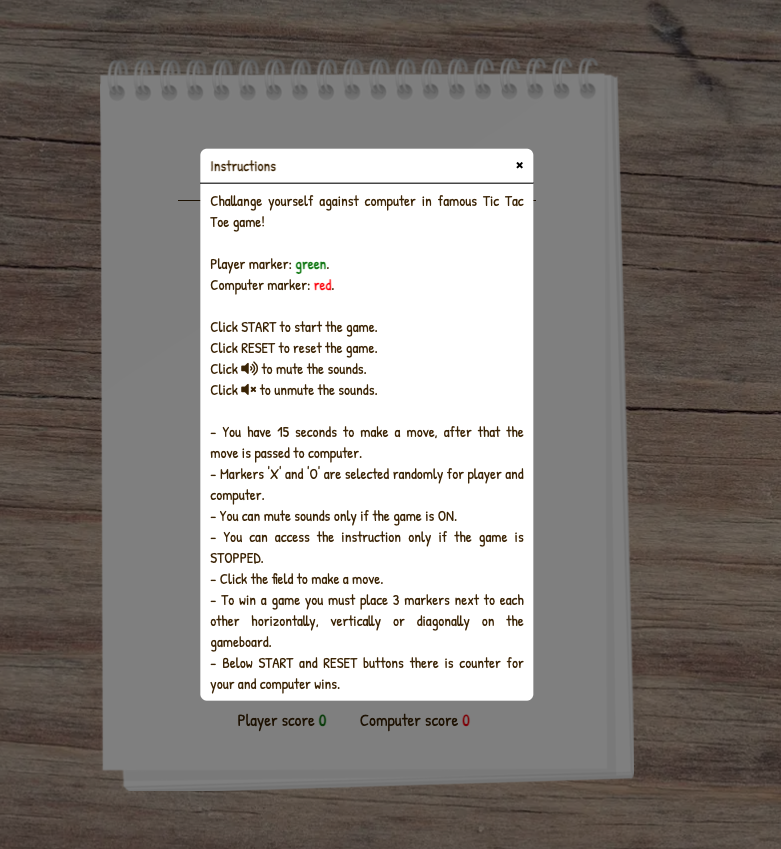

<h1 align="center"><a name="top">TIC TAC TOE</a><h1>

Hello Stranger,

This web browser based **Tic Tac Toe** game is a simple solution for users who want to entertain themselves a bit while taking a break from work. The game is designed to play against computer with very basic algorithm of randomly selected fields. It is a single page web browser game with use of HTML and CSS for basic site structure and styling with JavaScript handling the DOM and the gameplay itself.

You can start the game [*here*](https://miloszmisiek.github.io/ci_p2_tictactoe/).

Enjoy your journey!

# Contents
- **[User Experience](#user-experience)**
- **[Features](#features)**
- **[Credits](#credits)**

# User Experience
## Wireframes
[Balsamiq](https://balsamiq.com/) was used to create wireframes as a part of project planning. They were used to discuss the concept of the website with a designated Code Institute mentor. The final project differs in some places from the original concept presented below to improve UX or responsiveness of the site.

### Landing Page

### Player Win Notice

### Smartphone View

## Site Structure
[Tic Tac Toe](https://miloszmisiek.github.io/ci_p2_tictactoe/) is a single page web browser game with buttons and gameboard area created to interact with a player. Body background is represented with wood structure and gamplay area is located on the notepad background to give user a feeling of playing a game on the physical wooden table and piece of paper.

# Features
The idea behind Tic Tac Toe represented in this project is to be of simple construction and intuitive to play. 

Player can access gameplay instructions from help button represented by question mark in the circle. The instruction window is only available if the game is stopped.

### Instructions Window

# Credits
## Content
- Colours visual representation come from [Scheme Color](https://www.schemecolor.com/flat-gray-ui-color-palette.php).
- Sound effects come from:
  - Main game theme:  
    - [Epic Song by BoxCat Games](https://freemusicarchive.org/music/BoxCat_Games)
    - [Music promoted by](https://www.chosic.com/free-music/all/)
    - [Creative Commons CC BY 3.0](https://creativecommons.org/licenses/by/3.0/)
  - Sound effects: [mixkit.co](https://mixkit.co/free-stock-music/)
