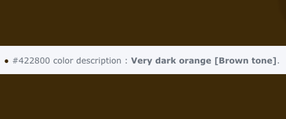

<h1 align="center"><a name="top">TIC TAC TOE</a></h1>

Hello Stranger,

This web browser based **Tic Tac Toe** game is a simple solution for users who want to entertain themselves a bit while taking a break from work. The game is designed to play against computer with very basic algorithm of randomly selected fields. It is a single page web browser game with use of HTML and CSS for basic site structure and styling with JavaScript handling the DOM and the gameplay itself.

You can start the game [*here*](https://miloszmisiek.github.io/ci_p2_tictactoe/).

Enjoy your journey!

# Contents
**- [Contents](#contents)**
**- [User Experience](#user-experience)**
  - [User Stories](#user-stories)
  - [Wireframes](#wireframes)
    - [Landing Page](#landing-page)
    - [Player Win Notice](#player-win-notice)
    - [Smartphone View](#smartphone-view)
  - [Site Structure](#site-structure)
    - [Fonts](#fonts)
    - [Colour](#colour)
**- [Features](#features)**
  - [Gameplay](#gameplay)
  - [Game Arena](#game-arena)
    - [Game Title](#game-title)
    - [Game Controls](#game-controls)
    - [Player Information/Gameplay Messages](#player-informationgameplay-messages)
    - [Gameboard](#gameboard)
    - [Start/Reset Buttons](#startreset-buttons)
    - [Score Section](#score-section)
    - [Instructions Window](#instructions-window)
    - [Audio Elements/Sound Effects](#audio-elementssound-effects)
  - [Future Features](#future-features)
**- [Technologies Used](#technologies-used)**
**- [Testing](#testing)**
**- [Deployment](#deployment)**
  - [Using GitHub Pages to deploy the project.](#using-github-pages-to-deploy-the-project)
  - [Fork a repository.](#fork-a-repository)
  - [Clone a repository.](#clone-a-repository)
**- [Credits](#credits)**
  - [Content](#content)
  - [Media](#media)
**- [Acknowledgements](#acknowledgements)**

# User Experience
## User Stories
- As a user, I want to play intuitive.
- As a user, I want to have access to instructions which are clearly identified.
- As a user, I want to play muted in cases it will interrupt the others around me.
- As a user, I want to be entrained through complete gameplay.
- As a user, I want to see my score and my opponent's score.
- As a user, I want to have a fair game.
- As a user, I want to play mobile if I must travel.
## Wireframes
[Balsamiq](https://balsamiq.com/) was used to create wireframes as a part of project planning. They were used to discuss the concept of the website with a designated Code Institute mentor. The final project differs in some places from the original concept presented below to improve UX or responsiveness of the site.

### Landing Page

### Player Win Notice

### Smartphone View

## Site Structure
[Tic Tac Toe](https://miloszmisiek.github.io/ci_p2_tictactoe/) is a single page web browser game with buttons and gameboard area created to interact with a player. Instruction window is available through help-button represented with question mark in the circle. Next to help-button there are volume ON/OFF button and timer. To control gameplay there are buttons below the gameboard and the very last part is player and computer score counter.

### Fonts
Two styles of fonts are used for the project: 'Cabin Sketch' for heading (game title) and 'Patrick Hand' for body text elements. The choice was made to represent best the handwriting effect. All fonts are backed-up with sans-serif.

### Colour
The body background photo was selected to imitate wooden table. Gameplay area background photo represents white notepad. Together they contrast well and gives user the feeling of playing a game on piece of paper laying on the table. 
 Green is a color representing player in the game.
 Red is a color representing computer in the game. 
 Markers, score and gameplay messages are coloured depending on player's or computer's action.
This contrasts well, green and red are strong colours, so user will easily recognize which actions were taken.  
 Text colour is very dark orange, brown tone , the inspiration came from Start/Reset buttons styling found in [getcsssan.com](https://getcssscan.com/css-buttons-examples). It was noticed to contrast well with all gameplay elements.  
  
 Start/Reset buttons have background colour of light grayish orange. It adds a pinch of colorfulness to the gameplay area.  
  

# Features
The idea behind Tic Tac Toe represented in this project is to be of simple construction and intuitive to play. Gameboard is centered vertically and horizontally, for mobile devices it occupies almost all screens.

## Gameplay
- When player clicks **START** button markers 'X' and 'O" are randomly distributed to Player and Computer.
- Who has first move is randomly drawn - like "coin flip".
- Player's marker is always green and computer is always red.
- To **win a game**, Player (or Computer) must place his **mark 3 fields** next to each other vertically, horizontally or diagonally. 
   
- Player and Computer can mark only once per turn.
- Player has **time limit** for his move equals to **15 seconds**.
- Timer starts when Player press **START/RESTART** button and is reset after every turn.
- After every win respective score counter is updated for Player or Computer.

## Game Arena
### Game Title
- Location: top of gameplay area
- Simple design, game title separated with a line from the next section.

### Game Controls
- Location: under Game Title.
- Elements:
  - Timer - counts down from 15sec to zero.
  - Volume Button - mutes/plays game's sound effects(only during gameplay). Icon changes depending on volume preference.
  - Help Button - gives access to game instructions (only if game is stopped).
- Buttons when hovered change the colour to orange to help user identify interactive elements.

### Player Information/Gameplay Messages
- Location: above and below gameboard.
- Top area gives player information which marker is selected to player and to computer.
- Bottom area gives player information regarding who moves first, win/lose/tie condition and when time to make a move has elapsed.

**STARTING CONDITION**  

**TIMER END** 

**WINNING CONDITION (COMPUTER EXAMPLE)** 

**TIE CONDITION** 

### Gameboard
- Location: center of gameplay area.
- Constructed using JavaScript, represents traditional 3x3 Tic Tac Toe grid.
- Every square is "clickable" and will represent user action, if the move is valid.
- Markers are represented with classic Tic Tac Toe signs: letters 'X' and 'O'.

### Start/Reset Buttons
- Location: bottom of gameboard, below Player Information.
- Start Button - starts the game, controls the logic of JavaScript for game ON condition.
- Restart Button - when the game is finished, player has an option to play again. Restart button clears the board and resets the timer but allows for score count.
- Reset Button - resets the game and scores. Clears the gameboard, resets the timer and resets scores back to zero.
- Both buttons when hovered, change background colour to white.

 

### Score Section
- Location: bottom of gameplay area, the last element in the column.
- Represents Player's and Computer's wins.
- Player number is green and Computer number is red - same as markers colour.

### Instructions Window
- Location: center of the screen.
- Instruction window is a pop-up type. It can be accessed by Help Button from Game Controls section.
- When window is active, dark overlay differentiates it from other elements.
- Window can be closed by pressing "x" in the top right corner of the window or by clicking anywhere outside the box.
- The instruction window is only available if the game is stopped.
- Contains basic gameplay instructions and describes elements of the gameboard.  

### Audio Elements/Sound Effects
- **Gameplay:** during game **ancient clock ticking** is played in the background to increase competitiveness by adding extra stressor.
- **Player makes a move:** after Player's valid move the **punch** sound is played to address Player's choice.
- **Player fails to make a move on time:** when timer finish countdown and Player did not make any move, a **gong** is played to address finish of the turn and Computer next move.
- **Player wins:** Player win is represented with a *Matthew McConaughey* famous line **"Alright, Alright, Alright!"** from the 1993 movie *"Dazed and Confused"*.
- **Computer wins:** Computer win is represented with an **evil laugh** from the 1995 game *"Mortal Kombat 3"* created by GT Interactive. The laugh belongs to game character *"Shao Kahn"*.
- **Tie Condition:** represented by famous line **"It's a trap!"** from the 1983 movie *"Star Wars: Episode 6 - Return of the Jedi"*. The line belongs to fictional character *"Admiral Ackbar"*.

## Future Features
- Add Player option to play with another player or with computer.
- Add difficulty levels with option for 6x6 or 9x9 gameboard.
- Add avatars to represent players.

# Technologies Used
- [HTML5](https://html.spec.whatwg.org/) - basic site structure.
- [CSS](https://www.w3.org/Style/CSS/Overview.en.html) - cascade styling for website.
- [JavaScript](https://developer.mozilla.org/en-US/docs/Web/JavaScript) - DOM handling and game logic.
- [Balsamiq](https://balsamiq.com/wireframes/) - wireframes used at planning stage.
- [Gitpod](https://www.gitpod.io/#get-started) - cloud development platform to deploy website.
- [Github](https://github.com/) - code hosting platform to host the website.
- [Convertio](https://convertio.co/) - web platform to convert files to any format, used to convert image files to .webp format.

# Testing
All various test results are presented in separate [TESTING](TESTING.md) file.

# Deployment
## Using GitHub Pages to deploy the project.
The website was deployed to GitHub pages. The steps are as follows:
1. In GitHub project repository, click on **Settings** tab.

2. On the left side, find **Pages** tab.
3. On the right side of navigation table, find **Source** section and select *main* in the *branch* tab, make sure *root* directory is selected, and press **Save**.
4. If steps were successfully followed, the green box will appear with a message that the site was deployed.

    *Until the site is published and ready to view, it can take several minutes for the server to response.*

The live link can be found here - [Tic Tac Toe](https://miloszmisiek.github.io/ci_p2_tictactoe/).
## Fork a repository.
A fork is a copy of a repository. Forking a repository allows you to freely experiment with changes without affecting the original project. The steps are as follows:
1. On the GitHub.com navigate to repository page.
2. In the top-right corner of the page, click **Fork**.

You can fork a repository to create a copy of the repository and make changes without affecting the upstream repository.
## Clone a repository.
In GitHub you have option to create a local copy (clone) of your repository on your device hard drive. The steps are as follows:
1. On the GitHub.com navigate to repository page.
2. Locate the *Code* tab and click on it.
3. In the expanded window, click the two squares icon to copy https link of the repository.

4. On your computer, open **Terminal**.
5. Navigate to the directory of choice.
6. Type **git clone** and paste the copied link of the repository.
7. Press **Enter** and the local clone of the repository will be created in the selected directory.

# Credits
## Content
- The main idea of how to build the game come from *James Q Quick* [YouTube Tutorial](https://www.youtube.com/watch?v=E621N5GBKv8&t=1341s).
- Modal pop-up window used for game's instructions section copied from *Web Dev Simplified* [YouTube Tutorial](https://www.youtube.com/watch?v=MBaw_6cPmAw).
- Part of code used for game's Score Area come from [Code Institute](https://codeinstitute.net/) 'Love Math’s' Essential Project.
- README file is based on game’s owner previous project [ECOCITY](https://github.com/miloszmisiek/ci_p1_ecocity) and some concepts are inspired from the fellow Code Institute student [Mycrosys](https://github.com/Mycrosys/marblesgame).
- README and TESTING files text grammar and typing were checked using [Microsoft Word](https://www.microsoft.com/pl-pl/microsoft-365/word).
- Fonts are implemented using [Google Fonts](https://fonts.google.com/).
- Icons are implemented from [Font Awesome](https://fontawesome.com/).
- Colours visual representation come from [Color Hexa](https://www.colorhexa.com/).
- START/RESET buttons styling come from [getcsssan.com](https://getcssscan.com/css-buttons-examples).
- Markdown table for Responsiveness section in TESTING file was created using [Tables Generator](https://www.tablesgenerator.com/markdown_tables).
- GitHub Deployment section come from [GitHub Docs](https://docs.github.com/en/get-started/quickstart/fork-a-repo).

## Media
- Sound effects come from:
  - Ticking Clock, Gong and Player's Move - [mixkit.co](https://mixkit.co/free-stock-music/)
  - Win and Tie conditions - [soundboard.com](https://www.soundboard.com/).
  - Lose condition - [soundfxcenter.com](http://soundfxcenter.com/).
- Images come from:
  - Notepad Gameplay Background - [Clipart Library](http://clipart-library.com/).
  - Body Wooden Background - [Pexels](https://www.pexels.com/).
  - Tic Tac Toe wins combinations - [Fun Paper and Pencil Games](https://funpaperandpencilgames.blogspot.com/2019/01/tic-tac-toe-strategy-tutorial.html) blog.

# Acknowledgements
[Tic Tac Toe](https://miloszmisiek.github.io/ci_p2_tictactoe/) website was created as part of [Code Institute](https://codeinstitute.net/) Full Stack Software Developer (e-Commerce) Diploma. I would like to express my gratitude and appreciation to my mentor [Precious Ijege](https://www.linkedin.com/in/precious-ijege-908a00168/) for his guidance on this project and flexibility with arranging sessions, [Code Institute](https://codeinstitute.net/) support team to always be there in case of need and fellow students for being in this learning journey together.

Milosz Misiek 2022
