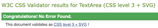

# Testing
## HTML, CSS and JavaScript Validators
Source codes was tested using HTML, CSS and JavaScript validators. No error was found, some warnings present.
1. HTML Validator [W3C Markup Validator](https://validator.w3.org/).
  
    

2. CSS Validator [W3C Jigsaw](https://jigsaw.w3.org/css-validator/)

    

3. JavaScript Validator [JSHint](https://jshint.com/).

- JSHint is a community-driven tool that detects errors and potential problems in JavaScript code. 
- To validate the [script.js](assets/js/script.js) file, free JSHint validator was used for this project. Below the results:
  - 79 warnings were present at first, all related to modern JavaScript code: "(...)is available in ES6 (use 'esversion: 6') or Mozilla JS extensions (use moz)." All warnings disappeared after adding one line of comment on top of [script.js](assets/js/script.js) file: "/*jshint esversion: 6 */"  
    

## Responsiveness
Responsiveness design was checked with [Google Chrome Dev Tools](https://developer.chrome.com/), [Safari Web Development Tools](https://developer.apple.com/safari/tools/) and with [Am I responsive?](http://ami.responsivedesign.is/). The website responds well to different screen sizes.

|        | Moto G4 | Galaxy S5 | iPhone 5/SE | iPhone X | iPad | iPad Pro | 1366 x 768 | 1920 x 1080 |
|--------|:-------:|:---------:|:-----------:|:--------:|:----:|:--------:|:----------:|:-----------:|
| Render |   pass  |    pass   |     pass    |   pass   | pass |   pass   |    pass    |     pass    |
| Images |   pass  |    pass   |     pass    |   pass   | pass |   pass   |    pass    |     pass    |

## Testing User Stories
- As a user, I want to play intuitive
  - Every button is clearly represented on his function and game logic follows the classic rules of Tic Tac Toe.
- As a user, I want to have access to instructions which are clearly identified.
  - Player can access instructions by Help Button represented with question mark in the circle.
- As a user, I want to play muted in cases it will interrupt the others around me.
  - Player has ability to mute the game sounds by clicking Volume Button. Volume button identifies the mute condition with selected icon.
- As a user, I want to be entrained through complete gameplay.
  - Different sounds accompany player throughout the game.
- As a user, I want to see my score and my opponent's score.
  - Separate section is used to distinguish Player and Computer score.
- As a user, I want to have a fair game.
  - There is random selection of first move and marker icon. Neither Player or Computer can make invalid move.
- As a user, I want to play mobile if I must travel.
  - The game is well responsive to all mobile screens and tablets.

## Browser Compatibility
ECOCITY website was successfully tested on following browsers with no issues noticed:
- Google Chrome Version 96.0.4664.110
- Mozilla Firefox Version 95.0.2
- Safari Version 15.2
- Microsoft Edge Version 97.0.1072.55
  
Layout and responsiveness stayed consistent for different viewports and browsers.
## Bugs
### 1. Computer can play when user clicks occupied field.
Bug was fixed by adding 'playerMove' boolean variable to 'fieldClicked' event listener in script.js:
- after click event the playerMove value is set to *true*
- when user makes a move on empty field, value is set to *false*
- only when playerMove value is *false*, *computerPlay()* function can be executed
### 2. Uncaught (in promise) DOMException: The play() request was interrupted by a call to pause().
Bug was fixed by removing a pause() method from the markerSound element in fieldClicked function and adding if statement to markerSound.play() method.

## Google Lighthouse
The website was tested using [Google Lighthouse](https://developers.google.com/web/tools/lighthouse) in Chrome Dev Tools for desktop and mobile versions.
- Performance - rates how your website responds while loading.
- Accessibility - rates the accessibility of your website to all users (including impaired ones).
- Best Practices - rates how your websites include industry standards.
- SEO - *Search Engine Optimisation*, rates how your website is optimised for search engine results.
### Desktop Results

### Mobile Results

First tests resulted in Performance score approx. 75% (mobile devices), due to PNG file used for gameboard background photo. After test, image was converted using [Convertio](https://convertio.co/). This process resulted in Performance score improvement up to 86%.
